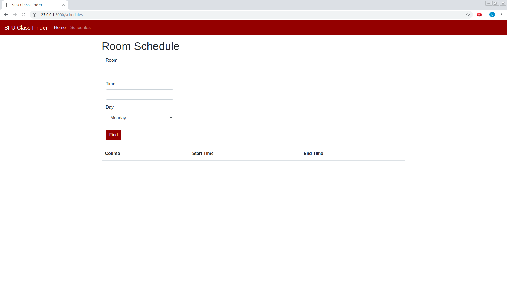
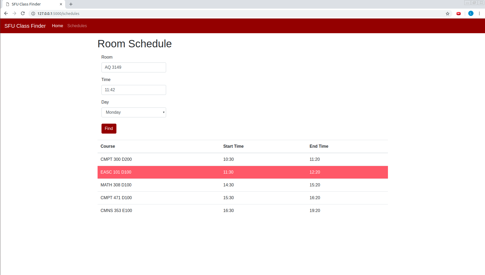
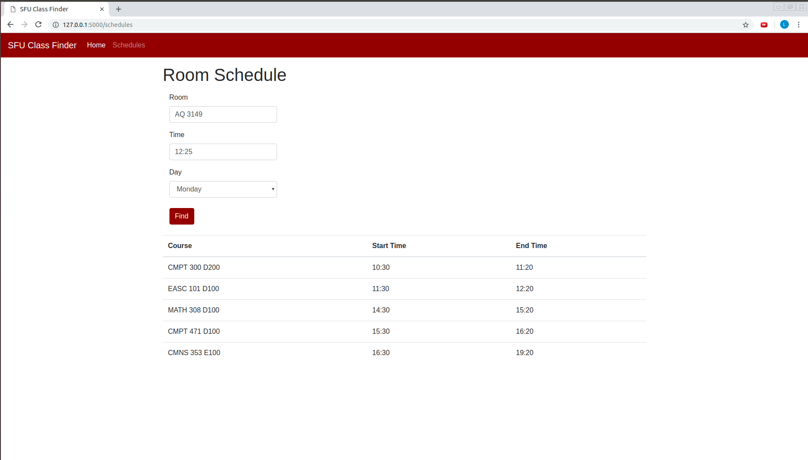
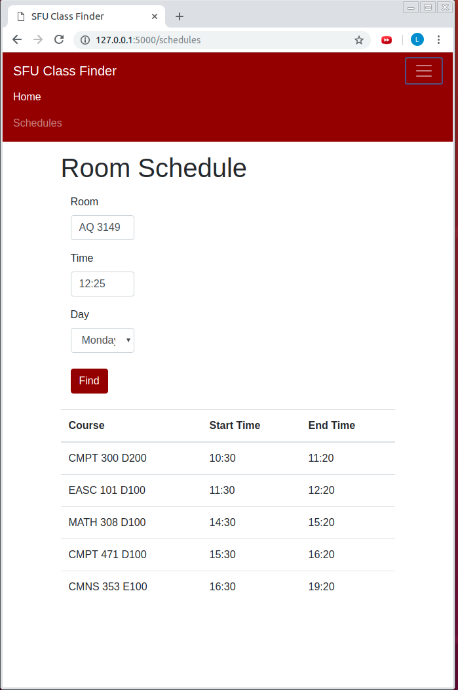

# SFU-Course-Finder
Web App for Finding SFU Courses using Room Number

    The landing page of the application.

    Allows users to search for course using room number and time

   Returns schedule for that room and highlights the course occuring at the specified time

    Returns schedule for the day even if there is no class at the specified time

    Formats nicely for smaller screens with a drop down menu

